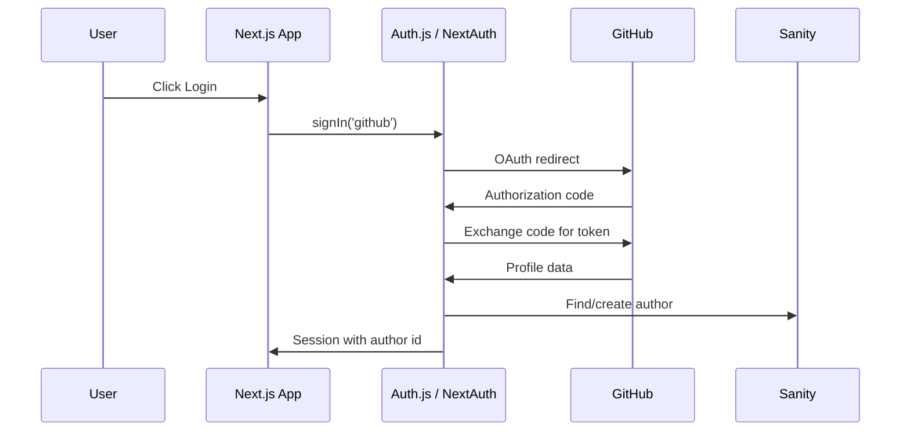

# Auth, Sanity, and Observability

The YC Directory app combines three backend concerns:

- GitHub OAuth authentication.
- Sanity as the content/data layer.
- Sentry for error and performance monitoring.

## Auth Flow



Important callbacks:

- `signIn`: create the author if missing.
- `jwt`: add durable author ID to the token.
- `session`: expose safe session fields to the app.

Do not expose provider access tokens unless the client truly needs them.

## Sanity Read/Write Split

Read client:

```ts
export const client = createClient({
  projectId,
  dataset,
  apiVersion,
  useCdn: true,
})
```

Write client:

```ts
import 'server-only'

export const writeClient = createClient({
  projectId,
  dataset,
  apiVersion,
  useCdn: false,
  token: process.env.SANITY_WRITE_TOKEN,
})
```

Rules:

- `writeClient` imports `server-only`.
- `useCdn: false` for read-after-write and auth callbacks.
- `useCdn: true` can be fine for public content.
- Secret token is never prefixed with `NEXT_PUBLIC_`.

## Live Content

The video uses Sanity live updates so new startups appear without a manual
reload. Treat this as a feature layer:

- Basic app works with normal queries.
- Live updates improve collaboration/freshness.
- Cache invalidation must still be designed for production.

## Observability

Sentry provides:

- Error events.
- Stack traces.
- Performance traces.
- Session replay.
- User feedback.

Professional answer:

> I add observability before the app has users because production bugs are
> usually environment, browser, account, or data-specific. Console screenshots
> from users are not a debugging strategy.

## Security Checklist

- GitHub OAuth callback URL matches deployed origin.
- Sanity CORS includes deployed app URL.
- Server Actions authorize before writing.
- Zod validates all form and AI inputs.
- Write tokens and AI keys are server-only.
- Sentry config does not leak private environment values.

