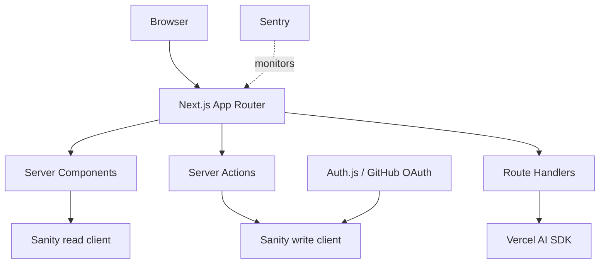

# YC Directory System Design

The project is a startup pitch directory:

- Users sign in with GitHub.
- Authenticated users create startup pitches.
- Pitches support title, description, category, image, and markdown body.
- Home page lists and searches startups.
- Startup details page shows content, author, view count, and editor picks.
- User profile page shows author info and submitted startups.
- AI can analyze a pitch into a structured score and feedback object.

## High-level Architecture



## Core Pages

| Route | Purpose | Rendering |
|---|---|---|
| `/` | Searchable startup feed | Server-rendered, URL query driven |
| `/startup/[id]` | Startup details | Cached/static body + dynamic views |
| `/startup/create` | Create pitch | Auth-gated page, client form, server mutation |
| `/user/[id]` | Profile | Cached profile + dynamic submitted startups |
| `/api/ai/pitch-analysis` | AI structured feedback | Route handler, server-only key |

## Data Model

```txt
author
  _id
  githubId
  name
  username
  email
  image
  bio

startup
  _id
  title
  slug.current
  description
  category
  image
  pitch
  views
  author -> author

playlist
  _id
  title
  slug.current
  select[] -> startup
```

## Request Flows

### Search

```txt
GET /?query=health
  page reads searchParams
  server fetches matching startups
  result HTML is returned
```

### Create Pitch

```txt
POST form action
  Server Action checks session
  Zod validates form + markdown
  write client creates startup
  cache tags/path invalidated
  user redirects to details page
```

### AI Analysis

```txt
POST /api/ai/pitch-analysis
  route validates input with Zod
  AI SDK asks model for Output.object(schema)
  SDK validates generated output
  route returns typed JSON
```

## Why This Is Interview-useful

This project touches the things interviewers ask about:

- Server vs Client Components.
- SEO and metadata.
- Caching and invalidation.
- Auth/session enrichment.
- Secure server-only write clients.
- Form validation and mutations.
- Streaming dynamic islands.
- AI output validation instead of trusting text.
- Deployment environment issues.

